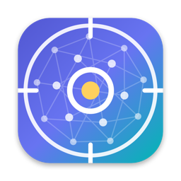
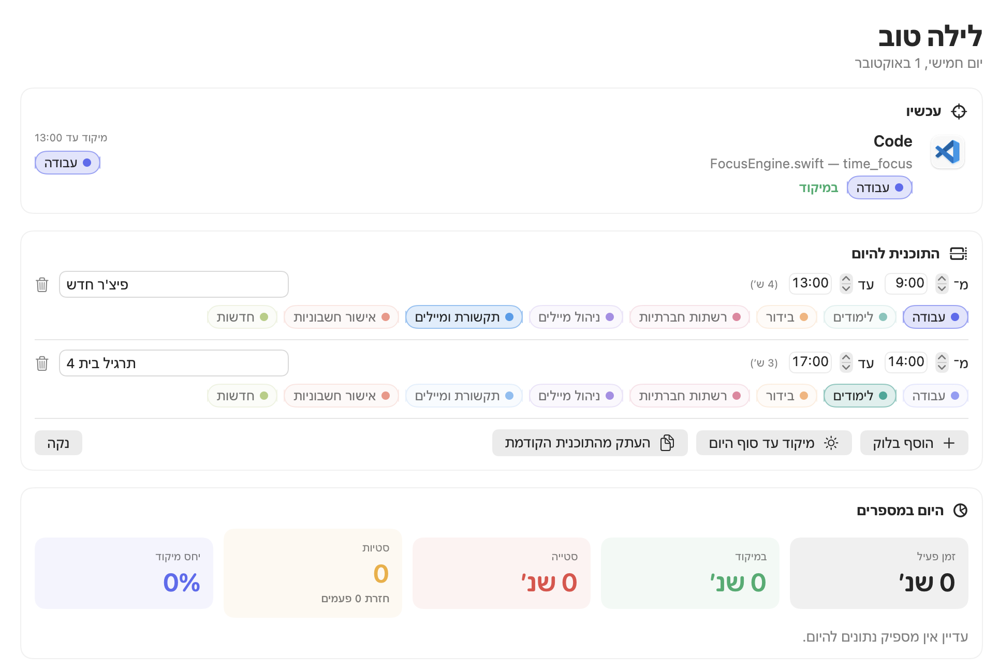
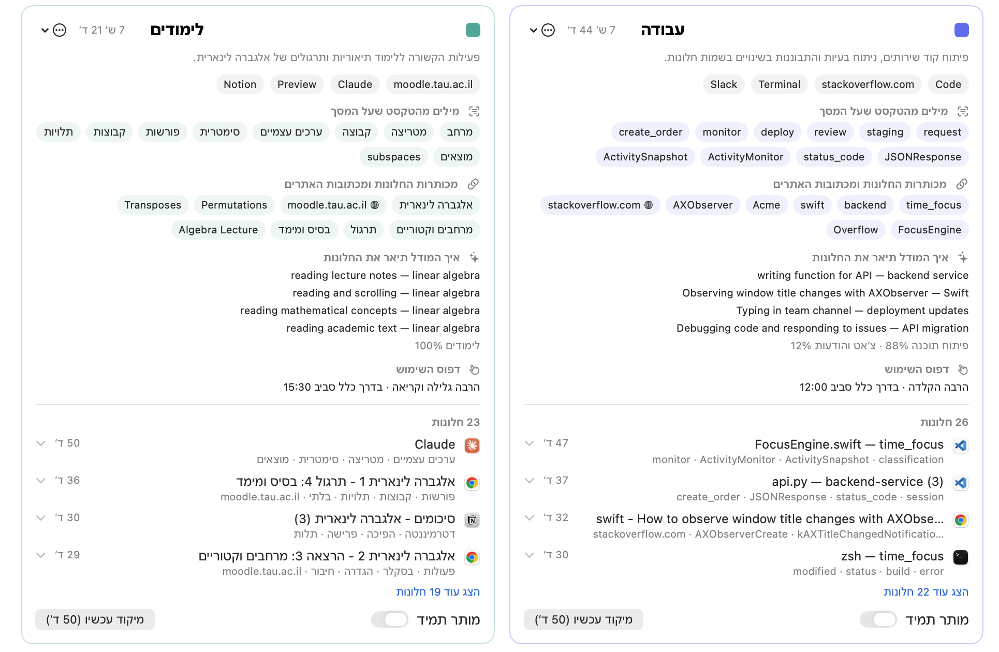
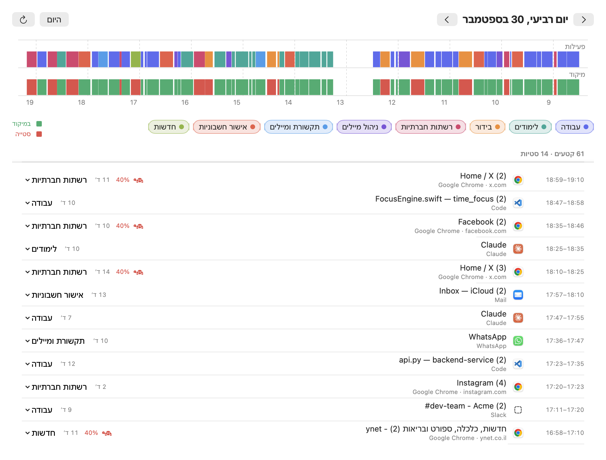
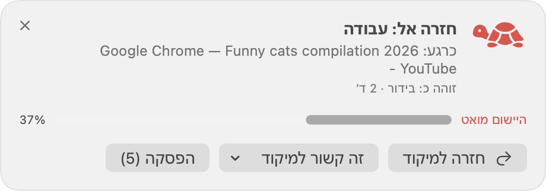

<div dir="rtl">

<p align="center"></p>

<h1 align="center">TimeFocus</h1>

<p align="center">עוזר מיקוד חכם ל-Mac. הוא לומד לבד מה אתה עושה במחשב, ועוזר לך להישאר על מה שבחרת.<br>הכל רץ על המחשב שלך, ושום מידע לא יוצא ממנו.</p>

---

האפליקציה לומדת בעצמה אילו **סוגי פעילות** יש לך במחשב (עבודה, לימודים, תקשורת, בידור…). כל יום בוחרים על מה להתמקד, לכל היום או לפי שעות, והיא עוזרת לך להישאר שם. כשסוטים מגיעה תזכורת עדינה, ואם ממשיכים, היישום המסיח **מואט בהדרגה** עד שחוזרים.

- **לומד לבד**: אין צורך להגדיר רשימות של אתרים ויישומים. הוא מזהה סוגי פעילות לפי מה שבאמת מופיע על המסך, גם בעברית.
- **מבין תוכן חדש**: הרצאה חדשה באותו קורס או משימה חדשה באותו פרויקט מזוהות כאותו סוג פעילות.
- **לא מעניש בטעות**: פעילות שהוא לא מכיר אף פעם לא מואטת. במקום זה הוא שואל, והתשובה שלך מלמדת אותו.
- **פרטי לגמרי**: רשת נוירונים קטנה, טרנספורמר רב-לשוני ומודל שפה בקוד פתוח רצים על המחשב, **רק כשהוא פנוי**, ומשתחררים מהזיכרון ברגע שחוזרים לעבוד.

> ממשק האפליקציה בעברית. ([English summary below](#in-english))

| תכנון היום | סוגי הפעילות שהמערכת גילתה |
|---|---|
|  |  |
| **ציר הזמן** | **תזכורת כשסוטים** |
|  |  |

<sub>הצילומים נוצרו מנתוני דמו סינתטיים (`FocusSelfTest --make-demo`).</sub>

---

## דרישות

| | |
|---|---|
| **מערכת הפעלה** | macOS 14 (Sonoma) ומעלה. נבדק בפועל על macOS 27. |
| **מחשב** | Mac עם Apple Silicon (M1 ומעלה). מחשבי Intel לא נבדקו: הבנייה אמורה לעבוד, אבל Apple Intelligence וההתקנה בלחיצה של llama.cpp זמינות רק ב-Apple Silicon. |
| **זיכרון** | 8GB מספיקים (נבדק על M3 עם 8GB). במצב רגיל האפליקציה צורכת כ-50MB, והמודלים הכבדים נטענים רק כשהמחשב פנוי. |
| **מקום בדיסק** | כ-500MB למודל הייצוג הסמנטי (מומלץ). אם בוחרים מודל שפה, עוד 0.8 עד 2.5GB (אופציונלי). |
| **כלי פיתוח** | **Command Line Tools for Xcode**, חינמיים. **אין צורך ב-Xcode** (אם הוא מותקן, גם זה עובד). נבדק עם Command Line Tools 27 (Swift 6.4), וגם מול SDK של macOS 26.5. |
| **אינטרנט** | רק להורדת הקוד והמודלים. אחר כך האפליקציה לא ניגשת לרשת. |
| **Apple Intelligence** (אופציונלי) | macOS 26 ומעלה, כשהיא מופעלת בהגדרות המערכת. אם היא זמינה, משתמשים בה אוטומטית, בלי להוריד מודל שפה. |

---

## התקנה

האפליקציה מופצת כקוד מקור ונבנית על המחשב שלך בפקודה אחת. זה לוקח כמה דקות, ובסוף האפליקציה מותקנת בתיקיית היישומים.

### 1. התקנת Command Line Tools

פותחים את **Terminal** (חיפוש Spotlight עם ⌘+רווח, ומקלידים Terminal) ומריצים:

<div dir="ltr">

```bash
xcode-select --install
```

</div>

נפתח חלון התקנה. לוחצים "התקן" ומחכים שיסתיים. אם מופיעה ההודעה `command line tools are already installed`, הכלים כבר מותקנים.

כדי לבדוק שהכל תקין:

<div dir="ltr">

```bash
xcrun swiftc --version
```

</div>

אמורה להופיע שורה שמתחילה ב-`Apple Swift version`.

### 2. הורדת הקוד

<div dir="ltr">

```bash
git clone https://github.com/yosefkialy/TimeFocus.git
```

</div>

<div dir="ltr">

```bash
cd TimeFocus
```

</div>

> אפשר גם להוריד ZIP מהכפתור **Code ← Download ZIP** בראש העמוד ולפתוח אותו. אחר כך מקלידים ב-Terminal ‏`cd` ורווח, גוררים את התיקייה לחלון ולוחצים Enter.

### 3. בנייה והתקנה

<div dir="ltr">

```bash
scripts/build_app.sh --install
```

</div>

הסקריפט מקמפל את האפליקציה במצב release, חותם אותה חתימה מקומית (ad-hoc) ומעתיק אותה ל-`/Applications`. אם אין הרשאת כתיבה לשם, הוא מעתיק ל-`~/Applications`. אזהרות קומפילציה במהלך הבנייה תקינות. הבנייה הצליחה אם השורה האחרונה היא `installed to …/TimeFocus.app`.

### 4. הפעלה

<div dir="ltr">

```bash
open /Applications/TimeFocus.app
```

</div>

אפשר גם לפתוח מ-Launchpad או מ-Spotlight.

> **האפליקציה חיה בשורת התפריטים** (למעלה, ליד השעון) ואין לה אייקון ב-Dock. לחיצה על האייקון שם פותחת את התפריט, ומשם את "לוח בקרה".

### 5. הרשאות

בהפעלה הראשונה נפתח מסך הדרכה שמוביל אותך בין ההרשאות:

| הרשאה | למה | איך |
|---|---|---|
| **נגישות** (חובה) | לדעת איזה יישום וחלון פתוחים, מה כתובת האתר ומה הטקסט הגלוי | הגדרות מערכת ← פרטיות ואבטחה ← נגישות ← להפעיל את TimeFocus |
| **התראות** (מומלץ) | תזכורות עם כפתורי פעולה | מאשרים כשמופיעה הבקשה |
| **אוטומציה של דפדפנים** (מומלץ) | לקרוא את כתובת הלשונית הפעילה ב-Chrome/Safari ולזהות גלישה פרטית | כשמופיעה הבקשה "TimeFocus רוצה לשלוט ב-Google Chrome", לוחצים "אישור" |
| **הקלטת מסך** (אופציונלי) | רק לזיהוי טקסט (OCR), שמפעילים בהגדרות: קריאת תוכן שאין לו טקסט נגיש (PDF, שקפים בווידאו, תמונות), גם בעברית | הגדרות מערכת ← פרטיות ואבטחה ← הקלטת מסך |

> אם אחרי מתן הרשאת נגישות האפליקציה עדיין מבקשת אותה, צריך לצאת ממנה (תפריט ← יציאה) ולפתוח אותה מחדש.

### 6. מודלים

גם זה חלק ממסך ההדרכה. אפשר לחזור לזה בכל זמן במסך **"למידה ומודלים"**:

1. **מודל ייצוג: Multilingual E5 Small** (מומלץ, כ-490MB). מודל שמבין את המשמעות של מה שעל המסך, כולל עברית. לוחצים "הורד". בלעדיו המערכת עובדת עם ייצוג פשוט יותר ופחות חכם.
2. **מודל שפה** (אופציונלי): מתאר כל פעילות במילים ומציע שמות לסוגי הפעילות. יש שלוש אפשרויות:
   - **עם Apple Intelligence**: אם היא זמינה במחשב, משתמשים בה אוטומטית ואין מה להוריד.
   - **עם llama.cpp ו-Gemma**: לוחצים "התקן את llama.cpp" (הורדה רשמית מ-GitHub, כ-30MB, או `brew install llama.cpp`) ואז מורידים את **Gemma 3 1B** (כ-0.8GB, מתאים ל-8GB זיכרון) או את **Gemma 3 4B** (כ-2.5GB, איכות ועברית טובות יותר, צורך כ-3.5GB זיכרון בזמן הלמידה).
   - **עם שרת מקומי תואם OpenAI** (Ollama או LM Studio). האפליקציה מסרבת לכל כתובת שאינה המחשב עצמו.
3. **זיהוי טקסט (OCR) בעברית** (אופציונלי): ה-OCR של macOS לא קורא עברית, ולכן העברית נקראת ב-Tesseract (קוד פתוח). מתקינים אותו ב-Terminal:

   ```bash
   brew install tesseract
   ```

   ואז ב**הגדרות ← מעקב** מפעילים "זיהוי טקסט (OCR)", לוחצים "הורד" ליד "עברית (Tesseract)" (כ-3.7MB) ונותנים הרשאת הקלטת מסך.

זהו. מכאן פשוט עובדים כרגיל.

---

## מה קורה אחרי ההתקנה

| שלב | מה קורה |
|---|---|
| **איסוף** (ברירת מחדל: 3 ימים ולפחות 6 שעות פעילות) | האפליקציה רק מתבוננת. כשהמחשב פנוי היא מחשבת ייצוגים סמנטיים ומקבצת את הפעילות לסוגים. |
| **מתן שמות** | מגיעה הודעה: "זיהיתי N סוגי פעילות". אפשר לתת שמות (לא חובה, יש שמות מוצעים), **לאחד** קבוצות דומות או **לפצל** קבוצה מעורבת. לכל סוג רואים על מה המודל התבסס: מילים מהטקסט שעל המסך, מכותרות החלונות ומכתובות האתרים, ואיך מודל השפה תיאר כל חלון. לחיצה על חלון מראה מה נקלט ממנו, ומשם אפשר להעביר אותו לסוג אחר או לסוג חדש. |
| **פעיל** | כל יום בוחרים על מה מתמקדים (במסך "היום" או מהתפריט). המערכת ממשיכה ללמוד, מזהה תוכן חדש מאותו סוג ומגלה סוגי פעילות חדשים. |

**כשסוטים מהמיקוד** (ברמה "רגילה". אפשר לבחור גם "עדינה" או "קפדנית" בהגדרות):

- אחרי כ-15 שניות מופיעים חלון צף קטן או התראה: *"חזרה אל: עבודה"*, עם הכפתורים "חזרה למיקוד", "זה קשור למיקוד" ו"הפסקה".
- אחרי כ-45 שניות **היישום המסיח מתחיל להאט**: הוא מושהה לפרקי זמן קצרים וחוזרים, והעדיפות שלו יורדת לליבות החסכוניות. ההאטה מחמירה בהדרגה עד 85% בתוך 5 דקות.
- כשחוזרים לעבודה ההאטה משתחררת **מיד**.
- פעילות לא מוכרת **אף פעם לא מואטת**. במקום זה נשאלת שאלה ("זה חלק מהמיקוד שלך?"), והתשובה מאמנת את המודל.
- **עצירת חירום**: הקיצור `⌃⌥⌘.` או הכפתור בתפריט מבטלים מיד כל האטה ומשהים את ההתערבויות לשעה.

**תיקון המודל**: בציר הזמן לוחצים על תגית הסוג של חלון ומשייכים אותו מחדש. זה האות החזק ביותר ללמידה.

---

## עדכון לגרסה חדשה

<div dir="ltr">

```bash
cd TimeFocus
```

</div>

<div dir="ltr">

```bash
git pull && scripts/build_app.sh --install
```

</div>

הנתונים, סוגי הפעילות והמודלים נשמרים. אחרי כל בנייה צריך לתת מחדש את הרשאת הנגישות (ההסבר בסעיף הבא).

---

## פתרון בעיות

<details>
<summary><b>אחרי עדכון או בנייה מחדש האפליקציה לא מזהה חלונות, למרות ש-TimeFocus מסומן ברשימת הנגישות</b></summary>

מערכת ההפעלה קושרת הרשאות לחתימת הקוד, ובחתימה ad-hoc (ברירת המחדל) החתימה משתנה בכל בנייה. הפתרון: בהגדרות מערכת ← פרטיות ואבטחה ← נגישות, בוחרים את TimeFocus, מסירים אותו עם **−**, מוסיפים אותו שוב עם **+** ופותחים את האפליקציה מחדש.

**כדי שזה לא יקרה בכל עדכון**, אפשר לחתום בתעודה מקומית קבועה:

1. פותחים את **גישה לצרור מפתחות** (Keychain Access) ← בתפריט: גישה לצרור מפתחות ← סייען אישורים ← צור אישור…
2. שם: `TimeFocus Local`, סוג זהות: שורש בחתימה עצמית (Self-Signed Root), סוג אישור: חתימת קוד (Code Signing) ← צור.
3. בונים עם התעודה (בפעם הראשונה macOS ישאל אם לאפשר גישה לצרור המפתחות: "אפשר תמיד"):

<div dir="ltr">

```bash
TIMEFOCUS_SIGN_IDENTITY="TimeFocus Local" scripts/build_app.sh --install
```

</div>

מתחילים לעבוד עם התעודה, ומתן ההרשאה אחרי כל בנייה כבר לא יידרש.
</details>

<details>
<summary><b><code>xcrun: error: invalid active developer path</code></b></summary>

ה-Command Line Tools לא מותקנים, או שעדכון של macOS מחק אותם. מריצים שוב `xcode-select --install`.
</details>

<details>
<summary><b><code>permission denied</code> כשמריצים את הסקריפט</b></summary>

זה קורה בעיקר אחרי הורדה כ-ZIP. מריצים `chmod +x scripts/*.sh` ומנסים שוב.
</details>

<details>
<summary><b>אני לא רואה את האפליקציה</b></summary>

אין לה אייקון ב-Dock. היא נמצאת בשורת התפריטים, למעלה ליד השעון. אם יש שם הרבה אייקונים, ייתכן שהיא מוסתרת מאחורי ה"מגרעת" של המסך. אפשר לסגור כמה אייקונים אחרים או לפתוח את "לוח בקרה" דרך Spotlight: מקלידים TimeFocus.
</details>

<details>
<summary><b>Apple Intelligence לא מזוהה</b></summary>

צריך macOS 26 ומעלה עם Apple Intelligence מופעלת (הגדרות מערכת ← Apple Intelligence ו-Siri). האפליקציה בודקת בזמן ריצה שכל ה-API שהיא נבנתה מולו קיים במערכת. אם עדכנת את macOS מאז הבנייה, צריך לעדכן את Command Line Tools ולבנות מחדש. עד אז המערכת משתמשת ב-Gemma, אם הוא מותקן. בדיקה מפורטת:

<div dir="ltr">

```bash
scripts/build.sh FocusSelfTest && .build-swiftc/bin/FocusSelfTest --apple-intelligence
```

</div>
</details>

<details>
<summary><b>האטה שלא משתחררת או יישום "תקוע"</b></summary>

הקיצור `⌃⌥⌘.` מבטל מיד כל האטה. גם אם TimeFocus קורס או נסגר בכוח, תהליך watchdog נפרד משחרר את כל מה שהוא השהה.
</details>

<details>
<summary><b>איפה הלוג?</b></summary>

בקובץ `~/Library/Application Support/TimeFocus/Logs/timefocus.log`. הוא לא כולל את תוכן החלונות.
</details>

---

## הסרה

1. בתפריט של TimeFocus לוחצים **יציאה**. אם הופעלה "הפעלה עם הכניסה למחשב", כדאי לכבות אותה קודם בהגדרות האפליקציה.
2. מוחקים את האפליקציה, את הנתונים והמודלים ואת ההגדרות:

<div dir="ltr">

```bash
rm -rf /Applications/TimeFocus.app ~/Applications/TimeFocus.app
```

</div>

<div dir="ltr">

```bash
rm -rf ~/Library/Application\ Support/TimeFocus
```

</div>

<div dir="ltr">

```bash
defaults delete com.timefocus.app
```

</div>

3. בהגדרות מערכת ← פרטיות ואבטחה ← נגישות (ובהקלטת מסך, אם ניתנה הרשאה) מסירים את TimeFocus עם **−**.

---

## מודלים

כל המודלים מקומיים, ורצים רק כשהמחשב פנוי.

| רכיב | תפקיד | מקור |
|---|---|---|
| רשת "תלמיד" (Embedding-bag + MLP, כ-5MB) | סיווג כל 4 שניות, פחות מ-1ms | נבנית ומאומנת על המחשב |
| **multilingual-e5-small** (טרנספורמר 118M פרמטרים) | ייצוג סמנטי רב-לשוני (עברית ואנגלית), "המורה" של הרשת | Hugging Face ‏(`intfloat/multilingual-e5-small`). רץ במנוע Swift/Accelerate שכתוב בפרויקט, ראו [docs/ENCODER.md](docs/ENCODER.md) |
| **llama.cpp + Gemma 3** (‏1B או 4B) | תיאור מופשט של כל פעילות, שמות לסוגים, סיווג zero-shot של תוכן חדש | הגרסה הרשמית של llama.cpp מ-GitHub, קובצי GGUF מ-Hugging Face (`ggml-org`) |
| **Tesseract** + מודל העברית (`heb`, ‏LSTM, כ-3.7MB) | זיהוי טקסט (OCR) בעברית באזור התוכן של החלון, כשה-OCR פעיל. אותיות לטיניות נקראות ב-OCR של macOS ‏(Vision) והשניים מתמזגים מילה-מילה | `brew install tesseract`, המודל מ-`tesseract-ocr/tessdata_best` ב-GitHub |
| **Apple Intelligence** | אותן משימות כמו Gemma, בלי הורדה ובלי זיכרון נוסף באפליקציה | מערכת ההפעלה. במצב "אוטומטי" מקבלת עדיפות על Gemma. נבדקה גם על חלונות בעברית, כ-1.5 שניות לקריאה |

---

## פרטיות ובטיחות

- **מה נשמר**: שם היישום, כותרת החלון (אחרי ניקוי), דומיין ונתיב, עד 3,000 תווים של טקסט גלוי מאזור התוכן של החלון (כתובות מייל ומספרי כרטיס מוסתרים), **ספירת** הקלדות, קליקים וגלילות (אף פעם לא תוכן ההקשות), וזמנים. כשה-OCR פעיל, צילום המסך נקרא בזיכרון ולא נשמר, ונשמר רק הטקסט שזוהה.
- **איפה**: רק ב-`~/Library/Application Support/TimeFocus` (SQLite). טקסט גולמי נמחק אחרי 14 יום (אפשר לשנות), ונשארים רק ייצוגים מופשטים.
- **מה לא נקרא אף פעם**: מנהלי סיסמאות (1Password, Bitwarden, Keychain…), חלונות גלישה פרטית ושדות סיסמה. אפשר להוסיף עוד יישומים ואתרים להחרגה, למשל הבנק.
- **רשת**: הגישה היחידה לאינטרנט היא הורדת מודל או runtime, רק כשלוחצים "הורד". קריאות למודל השפה נשלחות רק ל-127.0.0.1.
- **בטיחות ההאטה**: תהליך watchdog נפרד משחרר כל תהליך מושהה אם TimeFocus קורס. תהליכי מערכת, TimeFocus עצמו ויישומי שיחות וידאו לא מואטים אף פעם. יציאה מהאפליקציה משחררת הכל.

---

## פיתוח ובדיקות

<div dir="ltr">

```bash
scripts/build.sh                      # כל המטרות (.build-swiftc/bin)
scripts/build.sh TFWatchdog FocusSelfTest && .build-swiftc/bin/FocusSelfTest    # 23 בדיקות
scripts/build.sh EncoderCheck && .build-swiftc/bin/EncoderCheck      # אימות הטרנספורמר מול PyTorch (31 בדיקות)
```

</div>

הסקריפט `scripts/build.sh` קורא ישירות ל-`swiftc` (בלי SwiftPM ובלי Xcode) ובונה הכל מחדש אוטומטית כשגרסת הקומפיילר או ה-SDK משתנה. גם `swift build` בונה את כל המטרות (`swift build --show-bin-path` מראה לאן).

ב-UI משתמשים ב-`@ViewState` ולא ב-`@State`: החל מ-SDK 27, ‏`@State` הוא מאקרו של SwiftUI שהפלאגין שלו מגיע רק עם Xcode (ראו `Sources/TimeFocusApp/UI/ViewState.swift`).

הבדיקות מכסות:
- אימון הרשת והכללה לתוכן חדש, וזמן הסקה (0.04ms לחלון).
- אשכול היררכי מול מימוש נאיבי.
- מכונת המצבים של ההתערבות, כולל זה שזמן היעדרות לא נספר.
- **האטה של תהליך אמיתי**: ה-CPU יורד מ-100% לכ-15% ומתאושש.
- ה-watchdog אחרי `kill -9`: משחרר רק את מה שהאפליקציה השהתה, ולא נוגע בתהליך שמישהו אחר עצר או ב-pid ממוחזר.
- צנרת למידה מלאה עם ה-e5 האמיתי.
- מבחן אינטגרציה של המנוע: תוכנית, סטייה, תזכורת, האטה הדרגתית של התהליך הנכון ושחרור, ואיחוד סוגים שלא שובר את התוכנית.

כלי פיתוח:

<div dir="ltr">

```bash
.build-swiftc/bin/FocusSelfTest --make-demo /tmp/tf-demo [--with-llm]   # נתוני דמו ל-4 ימים + הרצת הצנרת
TIMEFOCUS_SUPPORT_DIR=/tmp/tf-demo .build-swiftc/bin/TimeFocusApp --snapshot /tmp/shots   # צילום כל המסכים ל-PNG
AUTO=1 .build-swiftc/bin/FocusSelfTest --cluster-report /tmp/tf-demo      # ניתוח איכות האשכולות
.build-swiftc/bin/FocusSelfTest --evidence-report /tmp/tf-demo             # מילות המפתח וההסברים שמסך "סוגי פעילות" מציג
.build-swiftc/bin/FocusSelfTest --llm-check [gemma-3-4b-it-Q4_K_M]         # בדיקת LLM מקומי מקצה לקצה
.build-swiftc/bin/FocusSelfTest --apple-intelligence                        # אותן משימות מול Apple Intelligence
```

</div>

> אם `swift build` נכשל מיד עם `spec … already registered`, נשארו קבצים מהתקנה ישנה של Command Line Tools. הפתרון: `sudo find /Library/Developer/CommandLineTools/usr/lib/swift/pm -type f -name "* *.xcspec" -delete`. הבעיה לא משפיעה על `scripts/build.sh`.

### מבנה הפרויקט

<div dir="ltr">

```
Sources/
  FocusTransformer/   מנוע BERT + טוקנייזר SentencePiece (Swift + Accelerate), ראו docs/ENCODER.md
  FocusML/            רשת התלמיד, אשכול היררכי, אב-טיפוסים, מסנן זמני, hashing, ייצוג רב-מבטי
  FocusCore/          מעקב (AX/AppleScript/OCR), אחסון, צנרת הלמידה, LLM, מנוע המיקוד, האטה, התראות
  TimeFocusApp/       SwiftUI: שורת תפריטים, לוח בקרה, תכנון, ציר זמן, סוגי פעילות, מודלים, הגדרות
  TFWatchdog/         tf-watchdog: תהליך הגנה זעיר שמשחרר האטות אם האפליקציה מתה
  FocusSelfTest/      בדיקות + כלי פיתוח
  EncoderCheck/       אימות הטרנספורמר
docs/ARCHITECTURE.md  הארכיטקטורה וה-ML בפירוט
scripts/              בנייה (build.sh), אריזה וחתימה (build_app.sh), יצירת האייקון
```

</div>

---

## מגבלות ידועות

- ה-OCR של Apple ‏(Vision) לא תומך בעברית (נבדק ב-macOS 27), וגם Apple Intelligence לא קוראת עברית מתמונות. לכן עברית ב-OCR נקראת ב-Tesseract, שצריך להתקין מ-Homebrew. בלעדיו תוכן בעברית נקרא רק דרך Accessibility, וזה עובד ברוב היישומים.
- בפעם הראשונה אחרי התקנה או עדכון, קריאת ה-OCR הראשונה לוקחת כחצי דקה: macOS מכין את מודל הזיהוי לתוכנה החדשה. מכאן והלאה כל קריאה לוקחת שנייה-שתיים.
- רק כ-46% מהאתרים מסמנים את התוכן הראשי שלהם. באתרים שלא מסמנים, האפליקציה חותכת את סרגלי הניווט, הכותרת והתחתית לפי מבנה הדף והפריסה שלו, ושורות שחוזרות בכמעט כל הדפים של אותו אתר מסוננות אחרי שהיא רואה כמה דפים ממנו.
- עברית אינה ברשימת השפות הרשמית של Apple Intelligence. בבדיקות היא טיפלה היטב בחלונות בעברית, אבל אם האיכות לא מספקת אפשר לבחור ב-Gemma במסך "למידה ומודלים".
- ב-Safari ההאטה חלה גם על תהליכי WebKit המשותפים (למשל תצוגת מייל), כל עוד הסטייה היא ב-Safari.
- זיהוי גלישה פרטית עובד ב-Chrome, Brave ו-Edge (דרך AppleScript) וב-Firefox (לפי הכותרת). ב-Safari אין דרך ציבורית לזהות אותה, ולכן מומלץ להחריג אתרים רגישים.
- ביישומים שכותרת החלון שלהם קבועה (למשל Claude, שבו הכותרת תמיד "Claude"), כל החלונות נחשבים לאותה פעילות.

---

## רישיון

הקוד מופץ תחת [רישיון MIT](LICENSE). מותר להשתמש בו, לשנות אותו ולהפיץ אותו, גם למטרות מסחריות, בתנאי שהודעת זכויות היוצרים והרישיון נשמרים. המודלים שהאפליקציה מורידה (E5, ‏Gemma, ‏Qwen) וה-runtime של llama.cpp אינם חלק מהמאגר, ולכל אחד מהם רישיון משלו.

</div>

---

## In English

**TimeFocus** is a fully local, ML-driven focus assistant for macOS. It learns your *activity types* on its own (work, study, communication, entertainment…) from what is actually on screen, including Hebrew text. You pick what to focus on each day, and it keeps you there: first a gentle nudge, then it gradually slows down the distracting app until you return. It runs a small student neural net in real time, a multilingual transformer (multilingual-e5-small, running on an engine in this repo written in pure Swift/Accelerate), and an open-source LLM (llama.cpp + Gemma, or Apple Intelligence). The heavy models run only while the Mac is idle. No data ever leaves the machine. The UI is in Hebrew.

**Requirements:** macOS 14+, Apple Silicon, and Xcode Command Line Tools (Xcode itself is not needed).

**Install:**

```bash
xcode-select --install
```

```bash
git clone https://github.com/yosefkialy/TimeFocus.git && cd TimeFocus
```

```bash
scripts/build_app.sh --install
```

Then open TimeFocus from `/Applications`. It is a menu-bar app, so it has no Dock icon. Grant Accessibility access when asked (System Settings → Privacy & Security → Accessibility). Download the E5 model from the onboarding screen. You can also add an LLM under "Learning & Models". Optional OCR (Settings → Tracking) reads only the window's content area — a page's main landmark or the page without its navigation, an app's document pane without its sidebars — and drops lines an app or site repeats in most of its windows. Apple's Vision OCR has no Hebrew, so Hebrew is read with Tesseract (`brew install tesseract`, then download the Hebrew model in Settings) and merged word by word with Vision's Latin text. Rebuilding with the default ad-hoc signature means you need to re-add TimeFocus to the Accessibility list. To avoid that, sign with a stable identity: `TIMEFOCUS_SIGN_IDENTITY="<cert name>" scripts/build_app.sh --install`.

See [docs/ARCHITECTURE.md](docs/ARCHITECTURE.md) for the architecture and ML design.

**License:** [MIT](LICENSE). The models the app downloads (E5, Gemma, Qwen) and the llama.cpp runtime are not part of this repository and come with their own licenses.
